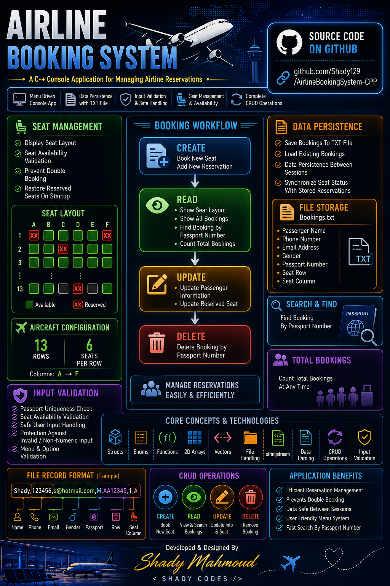

# ✈️ AirlineBookingSystem-CPP

  

## 📌 Overview

A simple Airline Booking System built using C++.

The system allows passengers to:

* Book seats
* View seat availability
* Save bookings to a text file
* Load existing bookings on startup
* View all reservations

The project simulates a basic airline reservation workflow while focusing on core C++ programming concepts.

---

## 🏗️ System Design

Console Application

Menu Driven Architecture

Data is stored using:

* Structs
* 2D Arrays
* Text Files

---

## ⚙️ Features

* Book Seat
* View Seat Status
* Save Booking To TXT File
* Load Existing Bookings
* Display All Bookings
* Passenger Information Management
* Seat Availability Validation

---

## 📂 Project Structure

AirlineBookingSystem

* Main Menu
* Passenger Management
* Seat Management
* Booking Management
* File Handling
* Data Parsing

---

## 🧠 Core Concepts

* Structs
* Enums
* Functions
* 2D Arrays
* File Handling
* stringstream
* Data Parsing
* Menu Driven Applications

---

## 💺 Seat Layout

Aircraft Configuration:

* 13 Rows
* 6 Seats Per Row
* Columns A → F

Example:

1A  1B  1C  1D  1E  1F

Reserved seats are marked as:

[XX]

---

## 💾 File Storage

File Name:

Bookings.txt

Stored Information:

* Passenger Name
* Phone Number
* Email Address
* Gender
* Passport Number
* Seat Row
* Seat Column

Example Record:

Shady,123456,[s@hotmail.com](mailto:s@hotmail.com),M,AA12345,1,A

---

## 🔄 Data Persistence

The system automatically:

* Saves bookings to file
* Loads bookings when the application starts
* Restores reserved seats from previous sessions

This prevents data loss between program executions.

---

## 🚀 How To Run

1. Open the project in Visual Studio
2. Build the solution
3. Run the application
4. Use the menu to manage bookings

---

## 💡 Future Improvements

* Search Booking By Passport Number
* Cancel Booking
* Edit Passenger Information
* Passenger Data Validation
* Seat Categories (Economy / Business)
* Ticket Generation
* OOP Version Using Classes
* Binary File Storage

---

## 👨‍💻 Developed & Designed By

Shady Mahmoud

< SHADY CODES />

---

🔥 This project demonstrates:

* C++
* Problem Solving
* Struct-Based Design
* Arrays
* File Handling
* Data Persistence
* Parsing Text Files
* Console Application Development
